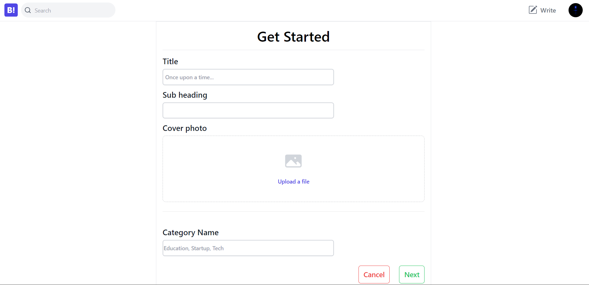

# BlogBar MERN Blogging Platform 🚀 

## Description:

The MERN Blogging Platform is a full-stack web application that empowers bloggers to share their thoughts and experiences with a global audience. Built using the MERN stack (MongoDB, Express.js, React, Node.js), this platform offers a feature-rich and user-friendly environment for both content creators and readers.

## Key Features:

**User Authentication:** Secure registration and login system for bloggers. 
**Rich Text Editor:** A powerful editor for formatting and styling blog content effortlessly. 
**Support Markdown:** Support quotes, links, and code in different different languages. 
**Blog Management:** Intuitive UI for creating, and deleting blog posts. 
**Discover Content:** Explore blogs by categories, users and search topics. 
**User Profiles:** Showcase your bio, profile picture, and published posts. 
**Engagement Features:** Commenting and liking for community interaction. 
**Responsive Design:** Ensures a seamless experience across devices. 

## Working Screenshots

## Home page

 

## Register page

## Login page

## User profile page

## User setting page

## Search Page 

## Write Page 

## Blog page

## Comment 

## Stay Connected:

Follow me on LinkedIn <a href="https://www.linkedin.com/in/prayansh-parmar/" target="_blank">Prayansh Parmar</a> for updates and announcements.

Happy Blogging! 📝✨
